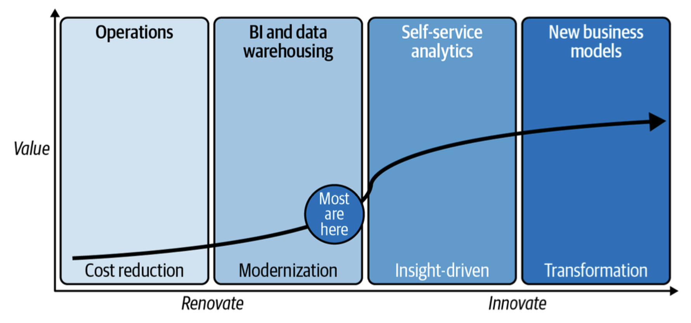
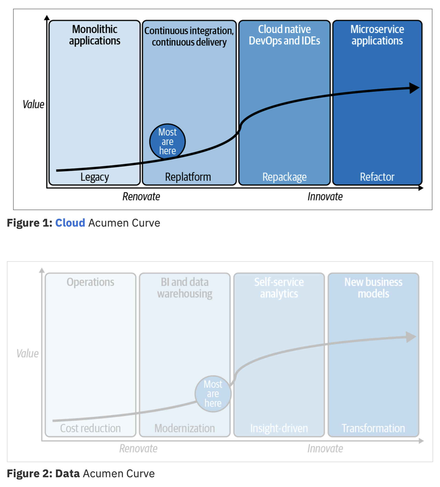
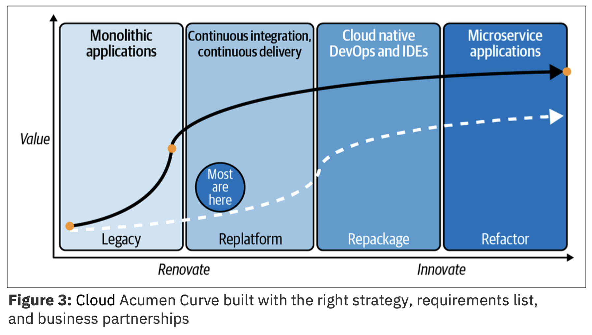

!!! tip "WATCH THIS DEMONSTRATION"
    **Christopher Bienko** (Principal, Learning Content Development, Hybrid Cloud) introduces the objectives and curriculum for *Modernizing Business for Hybrid Cloud with IBM Power and Red Hat OpenShift (CIO Persona) for Technical Sales Level 3*.

    Additional ways to watch: <a href="https://ibm.seismic.com/Link/Content/DC427CF9RRR3C8FQJbPjFbjM9fd8" target="_blank">direct download available from Seismic</a> (*2 minute runtime*).

---

#
# **Chief Innovation Officer — A Day in the Life**

---

**Amy**, the *Chief Innovation Officer* (CIO) for **Stacked Corp.**, has a formidable task before her: overseeing a rapid and seamless modernization effort of the company’s legacy application and services stack, as part of Stacked’s digital transformation strategy.

Amy’s team encompasses a range of disciplines, areas of specialization, and scope of responsibilities. It includes: developers and programmers, building out the next generation of applications while also maintaining legacy code; IT administrators, tasked with migrating the business into a new hybrid multicloud environment running on IBM Power Systems; as well as data scientists and other subject matter experts, who require uninterrupted access to the company’s services and data while this modernization effort is underway.

This is a company in the early days of their digital modernization efforts. How did they get here and where will they go next?

---

---

The modernization initiative that the CIO’s office has helmed didn’t emerge from a vacuum. Stacked Corporation’s strategy mirrors the experience of nearly every client (in nearly every industry) that you’ll speak with today: they are either spending money to save money or spending money to make money. Economics are a hugely compelling force behind why every enterprise is looking to digitally modernize today (although certainly not the only reason.)

When you spend it to save it, you’re *renovating*; and when you spend it to make it, you’re *innovating*. The best strategies will do both and leverage cost savings from renovating the IT landscape (spending money to save it) to partially fund the innovation (spending money to make it).

To illustrate this model, we’ll use something we call a **Data Acumen Curve**.

{: loading=lazy width="600"}

Note the emergence of a natural border between *renovating* and *innovating*. Every client needs to be able to derive downstream benefits of a renovation project, in order to justify the modernization efforts. This simple framework is handy for any strategic investment decisions a company will face across almost any domain.

---

There are several key takeaways from the **Data Acumen Curve**:

1. **Modernization strategy that focus solely on cost reduction deliver shortchanged value.**

    Wait, didn’t you just say that economics are a huge driver behind many enterprise’s push towards digital modernization? Indeed it is. But placing too strong an emphasis on *renovation* without *innovation* can be detrimental. Today’s technology is about efficiency, automation, optimization, and more. If you’re focused only on cutting costs, the value returned won’t be enormous. Don’t get us wrong, smart cost cutting is a terrific strategy and you can forward the money saved toward more renovation and compound that value into innovation, but that is not the end game (despite so many being forced to play it as if it was).
    
    Governance is a great example. Most organizations scurry to implement regulatory compliance with the least possible work to comply approach—mainly, avoidance of fines (cost savings). However, this approach shortchanges the value of such a project because it misses the opportunity to create regulatory dividends from those compliance investments (data lineage, for example) to accelerate analytics strategy.

2. **Most haven’t bent the curve for maximum value.**

    When you stop and take stock of where your organization truly is on an Acumen Curve, most will wake up and think *“Wow, we have a long way to go!”* We doubt few of the businesses that turned into divers, or had to contend with new arrivers, had any idea how truly broken their digital strategy was until COVID and disruption hit. That’s the point of these curves; you need to know ahead of time, not after the fact.

3. **Real value comes in the innovation phase.**

    Client's cannot modernize if all they're doing is spending money to save or make it, without also reimagining the way they work. Most organizations today are unwilling to do the deep rethinking of their business models and workflows that will allow them to fully embrace the opportunities presented to them by an innovation investment. As clients like Stacked develop their Acumen Curves, they must reimagine business processes from the ground up with new capabilities — we guarantee you that the impact will be greater for having done so.

{: loading=lazy width="600"}

We created the **Cloud Acumen Curve** (Figure 1 above) for plotting value as a business moves from monoliths to microservices (i.e. undergoing digital transformation and modernization). Note that the four quadrants are different from the curve shown earlier in Figure 2.

*Legacy* (monolithic) apps refer to those applications where the entire codebase is combined into a single program that runs in one place. Uber’s app, on the other hand, would sit somewhere on the far-right quadrant of this curve: it is made up of perhaps dozens, if not hundreds, of microservices that have very discrete jobs to perform.

It’s important to remember that some apps should stay the way they are because you have “bigger fish to fry”; your business may be looking for quick wins rather than long-haul (albeit worthwhile) projects, while some apps are too critical to the business to entertain the expense or risk of changing just yet. These apps will retain ongoing support as **legacy** code.

This naturally brings us to the middle phases on your journey to derive the most value you can from the cloud. This is where functions like archive, Q/A, and test have been **replatformed** to the cloud, resulting in real value drivers such as CI/CD.

*Mission-critical* apps can **replatform** to the cloud, too. For example, we’ve seen businesses with critical functions (running on-premises on AIX and IBM i servers) become modernized and reap public cloud benefits such as pay-as-you-go billing, self-service provisioning, and flexible management, without having to change the code. This approach helps you grow at your own pace and start a cloud journey without heavy up-front costs, allows your workloads to run when and where you want, and more.

---

The takeaway? As you move farther and farther to the right of the Cloud Acumen Curve (allowing digital properties to sit where they make sense) you gain more and more cloud acumen, which delivers more and more value to your business.

There’s a final consideration we want to explicitly note here: how partnerships matter. As you build out your cloud strategy, it is critical that it be open and portable: being able to build on one cloud property and move it to another either because of specific compute needs (resiliency, GPUs, quantum, and so on), vendor disagreement, or just having that option to negotiate better terms and pricing—flexibility is key.

{: loading=lazy width="600"}

Quite simply, the assets you create should be able to be deployed anywhere across your landscape to fully realize the benefits of your hard work. It's essential for every business to cultivate a cloud and digital modernization acumen so that your business leaders know what to look for, understand how to build teams, and recognize the benefits of your transformation efforts.

If we’ve been successful in persuading you, we think you’ll end up developing a modified Cloud Acumen Curve for your business similar to what you see in Figure 3, shown above.

Compare the curve in Figure 3 to the two previous curves shown (Figure 1 and 2). It bends drastically in the **renovation** phase because your business has enacted a digital transformation and modernization plan in support of it. Your organization creates downstream dividends from that plan and the work done in *renovation* drives *innovation*. We can’t stress enough how useful this model has been with the clients to whom we’ve been successful in delivering value. These acumen curves are how we get projects and conversations going, and how we hold each other accountable. 

---

#
# Next Steps

In the following module, you will receive the necessary pre-requisites and setup instructions for getting started with a hands-on OpenShift environment.