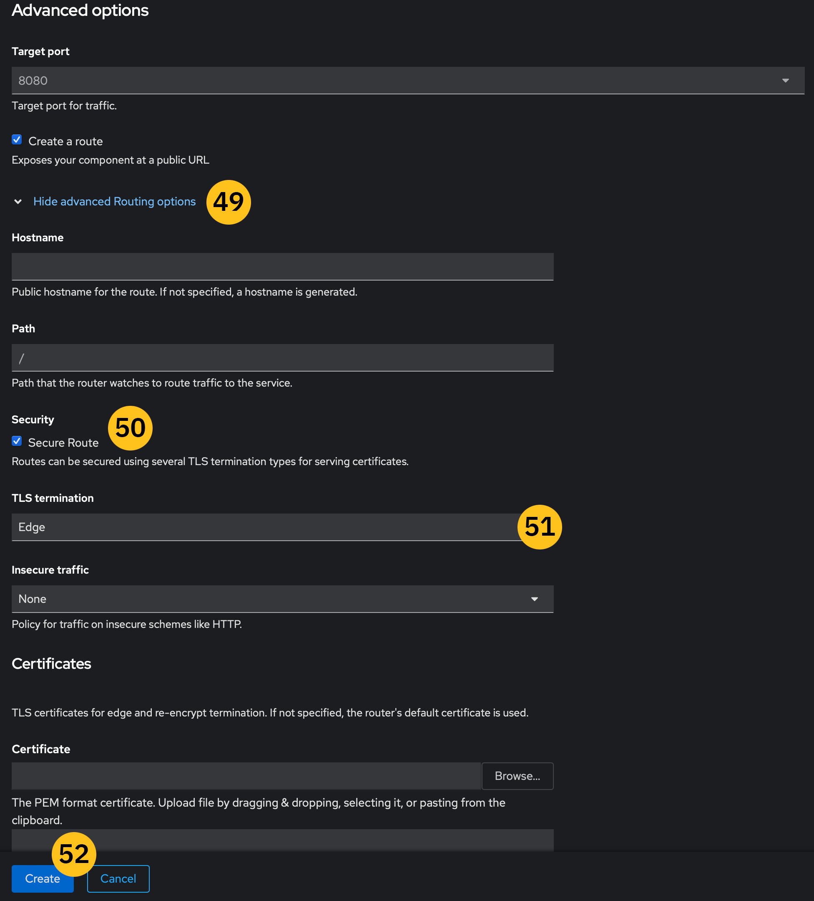

# **Module A:** Enable continuous deployment via Red Hat OpenShift S2I and GitHub webhooks

---


!!! tip "WATCH THIS DEMONSTRATION"
    **Christopher Bienko** (Principal, Learning Content Development, Hybrid Cloud) performs a hands-on demonstration of *Module A* using a live Red Hat OpenShift environment.

    Additional ways to watch: <a href="https://ibm.seismic.com/Link/Content/DCGqBQR3Xp9cf8cTPpgcgqXVg3bd" target="_blank">direct download available from Seismic</a> (*12 minute runtime*).

---

In this module, we'll journey with Amy's team of developers and application builders as they explore two different ways to leverage OpenShift's S2I framework and "webhooks" for managing and deploying source code into live applications. There are compelling reasons to use either of the two build strategies (Docker build or source build) — and both have their unique advantages of DevOps teams, which we'll explore in detail.

The Red Hat OpenShift **Source-to-Image** (S2I) framework eases Amy’s ability to create reproducible Docker container images from application source code. A **Dockerfile** is a recipe (or blueprint) for building Docker images. You will learn how to use OpenShift S2I to build a Docker image from a Dockerfile hosted in GitHub and deploy a container pod by using the image. You'll also learn how to set up a GitHub webhook to notify OpenShift of new code push and commit events so it automatically rebuilds and redeploys pods by using the latest changes to your code and the Dockerfile within your GitHub repo.

This module will make heavy use of **GitHub**, a ubiquitous tool in nearly every developer and programmer’s arsenal. Individuals, enterprise organizations, and open source community projects all use GitHub to share, deploy, and collaborate on code. Before getting started, make sure you have <a href="https://github.com/" target="_blank">signed up for a free GitHub account</a>. Once registered, you will be able to begin replicating (“forking”) project code from our lab repository into your own account — which you will then use to demonstrate OpenShift’s Source-2-Image capabilities for deploying applications via Dockerfiles (that are hosted on GitHub).

---

1. Open a web browser, log in to GitHub, and open the following IBM-operated repository: <a href="https://github.com/dpkshetty/oc-docker-s2i" target="_blank">https://github.com/dpkshetty/oc-docker-s2i</a>

    {: loading=lazy width="600"}

---

2. Click the **Fork** icon (as shown above). This will begin the process of replicating the code into your own repository.

    After executing a code fork, you should notice that the `oc-docker-s2i` repository is now available under your own GitHub account: in this example's case, `bienko/oc-docker-s2i`.

    You can now safely make changes and additions to our localized replica of the repository, without impacting the code available on the IBM repository.

    Keep the GitHub tab open on your Web browser — you'll be returning to it shortly — and return to the OpenShift Container Platform web interface you logged into earlier.

---

3. From the main landing page of the OCP cluster web interface, locate the **Administrator / Developer** toggle button near the top-left of the page. You will use this toggle frequently over the course of the hands-on lab to cycle between Administrator and Developer perspectives (and privileges) within the OCP cluster.

    For now, make sure it is toggled to **Administrator**.

    {: loading=lazy width="600"}

---

4. From the tabs on the left of the page, locate **Home** and then drill down into **Projects**.

---

5. Create a new Project for demonstrating OCP’s Source-2-Image capabilities, so from the top-right of the page click the **Create Project** button.

    - *Name*: set to `s2i-project`
    - *Display name*: set to `s2i-project`
    - *Description*: set to a description of your choosing

    Once satisfied, click **Create** to confirm.

    {: loading=lazy width="600"}

---

6. After creation of the `s2i-project`, toggle the perspective button in the top-left to **Developer**.

    {: loading=lazy width="600"}

---

7. Click the **Topology** tab from the left navigation bar. As expected, no resources have yet to be assigned.

---

8. Verify that the Project is set to the same one you created as an administrator in Step 5 (`s2i-project`).

---

9. Next you want to deploy our first application to the OCP cluster. From the left navigation bar, click **+Add**.

---

10. OpenShift supports adding code, assets, and applications from a massive gamut of sources. From the +Add page, scroll down and locate the **Git Repository** section. Within this grouping is the field **Import from Git** — select this option to open a configuration page.

    {: loading=lazy width="600"}

---

11. For the **Git Repo URL**, switch back to the GitHub tab to your personal repository (the one you forked previously) and copy the URL into the OCP configuration page. The URL should look something like: `https://github.com/[your_account]/oc-docker-s2i`

    {: loading=lazy width="600"}

---

12. Click the **Show advanced Git options** button just below the URL field.

    Enter `main` under **Git reference**.

---

13. In the **Context dir field**, enter `/redhat` to specify the directory within the forked repository where the Dockerfile code is stored.

---

14. Scroll down until you reach the **General** section. Here you can provide an `Application Name` and a unique `Name` that will be associated with the resource. Note that if an image already exists in OCP with the same name you will receive an error message — be sure to use a unique name.

    {: loading=lazy width="600"}

---

15. The next field to examine is labelled **Resource Type** section. Clicking the name will produce a drop-down menu with *two* options for the type of resource OCP will generate.

    Set the **Resource Type** to the `DeploymentConfig` option.

!!! warning "RECORD THIS VALUE"

    Record the name of the *alternative* resource type (hint: the one *not* labeled `DeploymentConfig`).

---

16. **Target Port** can be left on the default value of `8080`.

    Make sure that the **Create a route** (to the application) box is *enabled* before continuing.

---

17. When satisfied, click the **Create** button.

---

18. Your browser will redirect to the **Topology** tab, which will no longer be empty as before, but will now display a tile for the `oc-docker-s2i` you just configured.

    {: loading=lazy width="600"}

    It will take a minute or two for the container build and deployment to complete. Wait until you see a circular green checkmark icon, which indicates `Build Ready`, to appear next to the application tile before continuing
    
    Click the **rectangular icon** containing text similar to `(DC) oc-docker-s2i` (your exact naming may differ), located just below the OpenShift logo at the center of the tile. Doing so will pull open an overview panel along the right side of the web interface.

    From this panel you can peruse a number of details on the status and health of your application. If you’re quick enough, you may notice that the **Builds** category still shows that the application is still in the middle of being automatically deployed and orchestrated by OpenShift. In a few moments, that build order will resolve to *“complete.”* Likewise, containers are automatically provisioned to house and execute the code you deployed via GitHub.

---

19. From within the overview panel along the right side of the interface, click the **name** of the application (`oc-docker-s2i`, as shown) to drill down into further details and to expose information on the pod(s) that it is running across.

    {: loading=lazy width="600"}

    By clicking on the name of the **DeploymentConfig** (`oc-docker-s2i`), you are exposed to much more granular details on the status of the application. From this panel, you can modify nearly every aspect of how the containerized application is running on the OpenShift cluster, including how many replicas are available (we’ll experiment with this later), how resources are allocated, and so on.

    !!! warning "RECORD THIS VALUE"

        On the right side of the **DeploymentConfig** details panel, in white text, there is a field `Update Strategy` which details how new app Builds are generated. Record the default value it is set to.

    {: loading=lazy width="600"}

---

20. In order to execute instructions on the `oc-docker-s2i`, we’ll need to interface directly with the pod (container) it is running upon. From the tabs along the top of the panel, click **Pods**. When that page has loaded, click the **Name** of the pod (`oc-docker-s2i-1-852rw`, for example).

    {: loading=lazy width="600"}

---

21. Within the **Pod Details** panel, you have the option to further inspect the configuration and status of individual containers (pods) associated with the `s2i-project` deployment. To interface directly with the pod and issue commands, you can access the Web interface built-in console via the **Terminal** tab.

    {: loading=lazy width="600"}

    The console can be used to issue commands to the pod in an identical way you would use any Linux / SSH interface.

---

22. Issue the following command to inspect the running output of the pod processes, which is executing the code that you originally forked from GitHub:

``` shell
ps aux | grep sleep
```

!!! warning "SLEEP INFINITY"

    Verify that the pod is running a `sleep infinity` process. This will become important at a later stage of this module.

!!! note "GITHUB WEBHOOKS"

    **GitHub Webhooks** allow external services, such as OpenShift Container Platform, to be notified when certain events happen — like updates to application code. Amy’s team is continuously pushing updates to their application code base, and being able to automatically trigger updates to live applications when her developer teams commit new source code will greatly accelerate their responsiveness and agility.

    To automatically deploy a new pod when updates to the GitHub Dockerfile occur, you must first configure your GitHub repository with a webhook that OpenShift provides as part of the **BuildConfig**. This is best achieved by using the OpenShift web interface — so let’s continue using that.

---

23. With the **Developer** perspective still active, select the Builds tab (left side) and then click the name of the running application (`oc-docker-s2i`) you wish to modify.

---

24. Within the **BuildConfig Details** panel, scroll down to the bottom of the page where you will find the **Webhooks** category. There are two classes of Webhooks that are available to you: `Generic` and `GitHub` types.

    You will need to store the **GitHub webhook** details for use within GitHub shortly. Use the **Copy URL with Secret button** in the right-most column of the GitHub row and then *store this on your notepad*.

    {: loading=lazy width="600"}

---

25. Return back to the open GitHub tab from earlier. From your *personal account* fork of the `oc-docker-s2i` repository, click the **Settings** tab as shown.

---

26. From the **Settings** page, click the **Webhooks** tab (left). If you haven’t set up a webhook previously, this should display an empty page. Click the **Add Webhook** button.

    {: loading=lazy width="600"}

---

27. Into the **Payload URL** field, paste the URL captured in Step 24 into this box.

    {: loading=lazy width="600"}

---

28. Use the **Content Type** drop-down and correct the value to use `application/json` format.

---

29. To prevent complications with SSL certificates, you must check the `DISABLE` field under **SSL Verification** category. However, this is not recommended in real-world scenarios.

---

30. When satisfied, click the **Add Webhook** button.

---

31. Your Web browser will be returned to the Webhooks panel, where the newly-generated webhook (denoted by what looks like an HTTPs address) will be listed.

    Click the **Edit** button located to the right of your newly-created Webhook's name. A new panel will load with two tabs at the top: *Settings* and *Recent Deliveries*.
    
    Click the **Recent Deliveries** tab to validate that the webhook is working properly. There should be a green checkmark to the left of an alphanumeric string (representing a recent request or response between the webhook and OpenShift Container Platform on PowerVS).

    {: loading=lazy width="600"}
    {: loading=lazy width="600"}

!!! warning "RECORD THIS VALUE"

    Click the name of the alphanumeric string (something like `0daa9e50-90...`) to expand additional details on the delivery. Record the value of `Content-Type:` returned under the webhook’s Request **Headers**.

---

32. Your next step is to verify that the webhook is working as intended: monitoring changes committed to the source code in GitHub and propagating those versioning updates into the live application running via OpenShift. This will simulate an automated and agile workflow between Amy’s team of developers and the live applications supporting other areas of her business.

    To test the webhook, first return to the main landing page of your *personal account* replica of the `oc-docker-s2i` repository (for example, `https://github.com/bienko/oc-docker-s2i`). It is critical that in the steps to follow you are editing your *own* personal fork and not the main IBM branch that you originally replicated the code from.

    **Click** the `redhat` directory and then the `Dockerfile` asset from the subsequent page to view the code base of our running application.

    {: loading=lazy width="600"}

---

33. With the Dockerfile selected, click the **pencil icon** (as shown) to edit the content of the file.

    {: loading=lazy width="600"}

---

34. **Comment OUT** the following line (originally line 5 in the Dockerfile) by inserting a `#` at the start of the line:

``` shell
# CMD [“/bin/bash”, “-c”, “sleep infinity”]
```

Remove the `#` from the start of the following line (originally line 6 in Dockerfile) to make the instruction executable:
    
``` shell
CMD [“/bin/bash”, “-c”, “--”, “while true; do sleep 30; done;”]
```

The resulting file should look like the following screenshot:

{: loading=lazy width="600"}

---

35. Scroll down until you reach the **Commit Changes** panel. Here you can title your *code commit* and add a description of the changes made. Ensure that the **Commit directly to the main branch** button is selected (this will update only your personal replica — not the IBM branch).

    When satisfied, click **Commit Changes**.

    {: loading=lazy width="600"}
    {: loading=lazy width="600"}

---

36. Navigate back to your OpenShift Container Platform dashboard. Toggle the perspective changer to the **Administrator** view.

---

37. From the **Builds** tab, drill down into **Builds**.

    {: loading=lazy width="600"}
    {: loading=lazy width="600"}

    Under the Builds panel, you will likely see multiple versions of the `oc-docker-s2i` codebase. Likely the changes you committed to the Dockerfile on GitHub will still be in the process of propagating to OCP — which is reflected by the new build underway (`Running`) in the screenshot shown here.

    {: loading=lazy width="600"}

    When this status changes to `Complete`, a new build of the application is ready and has been pushed to the live version of the application. All done automatically via OpenShift’s Source-2-Image framework!

---

38. When the **Status** of the latest build of your application reads as `Complete`, toggle the perspective changer back to the **Developer** view.

---

39. From the Developer perspective, click the **Topology** tab from the left-side menu bar. Once again you will be presented with a view of the `oc-docker-s2i` deployment.

    {: loading=lazy width="600"}

    Click the center of the application to inspect it in detail.

---

40. Under the Builds category, you can see a replica of the completed builds viewed earlier under the Administrator perspective. Your next objective will be to verify that the code base of the applications has been updated to mirror the code changes you committed to GitHub earlier.

    **Click** the *name* of the running Pod as shown.

---

41. As before, click on the **Terminal** tab and enter:

``` shell
ps aux | grep sleep
```

{: loading=lazy width="600"}

!!! warning "RECORD THIS VALUE"

    Record the output from console.

The output from the Terminal should reflect the code changes you committed to the Dockerfile previously. If so, congratulations — you’ve successfully updated Amy’s application and automatically pushed those version changes into a new live build of the service!

You have successfully demonstrated OpenShift’s S2I capabilities by using a Dockerfile, deployed a pod from a Dockerfile hosted in GitHub, set up connectivity between OCP and GitHub by using a webhook, and tested to ensure that the new code changes within the repository resulted in a new pod deployment within your OpenShift cluster.

---

#
# **Shift Left, CI/CD, and Kubernetes**

---

To “**Shift Left**,” as developers put it, is to loop back on old processes, identify short‐ comings within the old ways of doing things, and steadily iterate on those designs to improve them through experience over time. Plenty of lessons are learned each year within the IT marketplace, and the pandemic years are certainly no exception. The disruption underway from this monumental shift in computing, as we enter the new decade, cannot be understated. How can a business have confidence that its choice of technology partner in this new paradigm is the correct one? 

The Japanese word ポカヨケ (*Poka yoke*) literally means “mistake-proofing” — its goal is to prevent inadvertent errors and eliminate product defects through early prevention and correction. 

For developers, the term shift left is a practice intended to find and prevent defects in the software development lifecycle. Left reflects the iterative loop that defines such software development cycles, putting forth changes that are tested and evaluated, again and again. 

The concept of Shift Left application development also wonderfully mirrors the same rigorous methodology of revisiting and questioning a null hypothesis using the scientific method. Shifting back to the left—pulling through again with a finer-toothed comb—and continuing to refine on the design (rather than pushing straight through to release with the first working prototype) puts the values of *Poka yoke* into practice. 

The ability to run an application in the cloud, in a way that’s independent of any cloud vendor—where your own datacenter or machine room can be one of those “vendors”—is a huge step forward. But there’s more to the problem than running the application. You need the ability to deploy it, you need the ability to integrate components together, and you need the ability to test in a modern way. What’s more, these capabilities all need to be automated—in part so they can be repeated reliably, but also so they can be performed repeatedly.

All of these capabilities come under the heading of **Continuous Integration & Continuous Delivery** (CI/CD). The deployment scenarios of 20 or 30 years ago, when a “deployment” was very likely to be a break-the-world change, with the entire development and operations teams keeping their fingers crossed and hoping nothing breaks, are a thing of the past. We’ve discovered that the way to deploy software reliably is to deploy it frequently, where each deployment represents a minor change to a very small number of features. If each release represents a minor change, changes are easy to roll back; changes can be deployed to a small number of users for testing; and, most of all, short, reliable release cycles force you to commit your release process to software. 

As mentioned before, **Kubernetes** (K8s) provides the building blocks of a PaaS—but it’s not an all-inclusive PaaS. One of the things Kubernetes explicitly doesn’t do is provide a native CI/CD process. In open source parlance, Kubernetes doesn’t have an opinion on CI/CD—which is coder talk for they don’t force you into a solution or template for this component; this can be good or bad. After all, developers definitely have formed their own opinions in this space, and DevOps processes tend to be custom fit to the team that implements them. This is one of the reasons that we think Kubernetes has become such an inflection point — K8s knows what it wants to do and it’s extremely good at doing it. For everything else, the open source community always finds a way.

One way that Kubernetes-based platforms such as Red Hat OpenShift make it easy to collaborate with the open source community— and readily deploy open source code into production environments —is via the Source-2-Image framework. In the following steps, you'll explore how Anne and her team can leverage such a framework to the benefit of her business.

---

#
# **Source Build**

---

Amy’s team has now successfully deployed application code via what we’ve coined the **”Docker build”** strategy. But what if her teams of DevOps engineers and developers want to leverage webhooks for working (and deploying) directly from the source code? Rather than needing to manually import source code from repositories such as GitHub— like you did in the previous steps —what if Amy could produce the same results with minimal micromanagement and better automation?

In the following steps, you'll reproduce a similar workflow to what you just completed (using a sample pyFlask web framework application hosted on GitHub), **but this time using webhooks to automatically notify OpenShift of new code push/commit events in GitHub**. The result will be that OpenShift automatically rebuilds and redeploys the application using the latest code changes in your GitHub repository, without much (if any) intervention from the DevOps team (you). Let’s get started.

---

42. In your web browser, open the OpenShift cluster dashboard and switch to the **Administrator** perspective. From the main landing page, drill down into **Home** > **Projects**.

    {: loading=lazy width="600"}
    {: loading=lazy width="600"}

    Click the **Create Project** button (located in the top-right corner) and assign it the name `pyflask-demo`, then click **Create** when satisfied.

---

43. Verify that the project has been created by returning to the **Projects** screen and searching for the project by name.

    {: loading=lazy width="600"}

    Your next step will be to replicate a simple pyFlask application— consisting of three API endpoints (root, version, and test) —which is hosted at the following repo: <a href="https://github.com/ocp-power-demos/s2i-pyflask-demo" target="_blank">https://github.com/ocp-power-demos/s2i-pyflask-demo</a>
    
---

44. Open a new tab in your web browser and navigate to your *personal* GitHub account (created earlier).

    Then visit the following link: <a href="https://github.com/ocp-power-demos/s2i-pyflask-demo" target="_blank">https://github.com/ocp-power-demos/s2i-pyflask-demo</a>
    
    Click the **Fork** button to replicate the code into your own GitHub repository. This will ensure that any changes made to the GitHub code only impact your own replica, rather than the main parent branch. This is the same procedure you followed earlier in this module.

---

45. Return to the OpenShift cluster dashboard and switch to the **Developer** perspective.

    {: loading=lazy width="600"}

    From the taskbar on the left, select the **+Add** button and then click the **From Git** option (located under the *Git Repository* category).

---

46. **Paste** the `URL` of your *personal* GitHub account’s fork of the `s2i-pyflask` application into the **Git Repo URL** field. OpenShift will automatically validate the URL and the Builder Image should display as a Python image.

    Click the **Show Advanced Git Options** toggle.
    
    For the **Git Reference** field, enter the value `main`.

    {: loading=lazy width="600"}

---

47. Scroll down to **General** and set `s2i-pyflask` for both the *Application Name* and *Name* fields.

---

48. Under the **Resources** section, make sure that the `Deployment` option is selected.

---

49. Scrolling further down under **Advanced Options**, ensure that you *enable* the `Create a Route` button.

    Click the `Show advanced Routing options` toggle to expose additional options.

    {: loading=lazy width="600"}

---

50. Leave the first several fields as their default settings. Scroll down until you reach **Security** and then enable the `Secure Route` box.

---

51. Further down, set the **TLS Termination** value to `Edge` and set **Insecure Traffic** to `None`.

    These modifications are necessary as OpenShift on Power Virtual Server by default only supports secure (HTTPs) routes by default.

---

52. When satisfied, click **Create**.

---

53. Your web browser will automatically redirect to the **Topology** page. From here, you will see a new application tile for your freshly-configured pyFlask service. Click the center of the application icon to pull open an overview.

    It will take several moments for the Build to configure and deploy — wait until the Build status reads as complete before moving to the next step.

---

54. After the Build is completed, find the **Routes** section at the bottom of the panel and click the `Location:` address to be directed to a live view of the running application. Disregard any *"Connection is not private"* warnings that your browser may produce and continue to the destination.

    {: loading=lazy width="600"}

    A new tab should open within your web browser displaying a message identical to the one presented in the following screenshot.

    {: loading=lazy width="600"}

---

55. Test the other two API endpoints that were part of the original pyFlask application code base that you replicated from GitHub, in order to validate that the full application was brought over and has correctly deployed.

    Add `/version` to the end of the URL for your application’s web address (Step 54) and then hit *Return* on your keyboard to load the new page.

    Validate that the `/test` endpoint is also working.

    !!! warning "RECORD THIS VALUE"

        Record the message displayed to screen when validating the `/test` endpoint.

    If all three endpoints are working then OpenShift has successfully deployed a containerized application pod directly from our GitHub repository.

---

56. Return to the OpenShift cluster dashboard and verify that you are using the **Developer** perspective.

    Drill down into the **Builds** tab, in which you should see an `s2i-pyflask` service.
    
    **Click** the *name* of the service.

    {: loading=lazy width="600"}

---

57. From the service details panel that opens, scroll down to the bottom of the page and locate the **Webhooks** section. There are two types— *Generic* and *GitHub* —which are displayed.

    At the far right of the *GitHub* row, click the **Copy URL with Secret** button.

    {: loading=lazy width="600"}

---

58. In a separate web browser tab, navigate to your personal GitHub account page.

---

59. From the tabs along the top of the page, click the **Settings** tab (far right) and then **Webhooks** from the list of panels that appear on the left side of the new page.

---

60. You might see existing **Webhooks** on this page already. Ignore any pre-existing Webhooks and generate a new one using the **Add Webhook** button.

    {: loading=lazy width="600"}

---

61. Under the **Payload URL** field, paste the *address* that was copied in Step 57.

    {: loading=lazy width="600"}

---

62. Update the **Content Type** field to `application/json`

---

63. Click the `Disable` option under the **SSL Verification** category.

---

64. When satisfied, click **Add Webhook**.

    The web browser will redirect back to the Webhooks page. It will take a few moments for the webhook to initialize and make its first deliveries to the OpenShift cluster. You will have confirmation that the webhook is working properly once a green checkmark and a `Last delivery was successful` statement appear on screen.

---

65. To inspect additional details about the webhook (and its deliveries), **click** the webhook *name* and scroll down to the bottom of the page, then click the icon as shown.

    !!! warning "RECORD THIS VALUE"

         Click the name of the alphanumeric string (something like `0daa9e50-90...`) to expand additional details on the delivery. Record the value of `Content-Type:` returned under the webhook’s Request **Headers**.

    Now you will modify the source code in your *personal* GitHub replica of the forked code.

---

66. Return to the main **Code** page of your personal account replica of `s2i-pyflask-demo` and click on the name of the `app.py` file within the directory of assets.

---

67. Edit the code of the Python script using the **pencil icon**.

---

68. On **line 10** of the application code, change the version number from `1.0` to `2.0`; afterwards, scroll down and click **Commit Changes** with the *Commit directly to the main branch* option selected. You may add comments describing the commit changes if you wish.

---

69. Go back to the OpenShift cluster dashboard and open the **Topology** page.

    Click the center of the `s2i-pyflask` application icon to pull up additional details on the app.

    Notice that a new Build has automatically been initiated (and may have already finished by the time you check this screen) as a result of the webhook’s two-pronged workflow: recognition of the changes you made to the application source code in GitHub; and immediately launching a new pod (running the updated code) for the `s2i-pyflask` application.

---

70. As before, scroll down the panel until you reach the **Routes** section.

    Click the *URL* to open a new tab with the updated `s2i-pyflask` application.

    Validate the changes made to the `/version` endpoint.

---

Note that the **Route URL** is unchanged from having updated the application between version 1 to version 2. If you already have the `/version` endpoint URL opened, you can refresh it to update the application view.

Congratulations, you have successfully used OpenShift's S2I capabilities on an OCP cluster running in Power Virtual Server. Amy's team have been able deploy an application to their OpenShift cluster directly from a GitHub-hosted source code, set up connectivity between OpenShift and GitHub using webhooks, and ensure that the new code changes to the source code repository resulted in a new version of the application being deployed automatically to the OpenShift cluster.

---

#
# Next Steps

In the following module, you will learn (alongside Amy's team) how to manage a basic application's lifecycle via OpenShift using a graphical interface method.