# **Module B**: Graphically create, scale, upgrade, and rollback an application on Red Hat OpenShift

---


!!! tip "WATCH THIS DEMONSTRATION"
    **Christopher Bienko** (Principal, Learning Content Development, Hybrid Cloud) performs a hands-on demonstration of *Module B* using a live Red Hat OpenShift environment.

    Additional ways to watch: <a href="https://ibm.seismic.com/Link/Content/DC6mDdRdH4RJf8hFmdgphdfRmQ6B" target="_blank">direct download available from Seismic</a> (*13 minute runtime*).

---

Amy, the CIO, has a mandate to increase the productivity and output of her developers and programmers. This is precisely the reason why Stacked Corp. chose to make the investment in a platform such as Red Hat OpenShift on Power Systems; but in turn, the company expects to see measurable gains across these metrics in order to justify the expense of the investment.

Ahead, you will learn (alongside Amy's team) how to manage a basic application's lifecycle via OpenShift (OCP): how to create and deploy an application from an existing Docker image, scale it according to workload demands, update it to a newer version, and finally rollback the application to a previous version.

You will tackle these challenges using two different approaches:

- **Module B**: the *graphical* user interface (GUI) method
- **Module C**: the *programmatic* command line interface (CLI) method

The first step will be the creation of an application within OpenShift Container Platform from an existing image hosted on a <a href="https://quay.io/" target="_blank">**Red Hat Quay.io**</a> repository. Quay.io is a Red Hat-owned registry for containerized images, providing a useful alternative to DockerHub for hosting images and code. In this module, you will be performing these operations *graphically* using the web interface provided by Red Hat OpenShift.

---

1. Open the main dashboard of the OpenShift web interface.

---

2.  Log in to your OCP cluster by clicking **htpasswd** and then supplying the account name (`cecuser`) and password credentials.

---

3. From the main landing page of the OCP cluster web interface, locate the **Administrator / Developer** toggle button near the top-left of the page. You will use this toggle frequently over the course of the hands-on lab to cycle between Administrator and Developer perspectives (and privileges) within the OCP cluster.

    For now, make sure it is toggled to **Administrator**.

---

4. From the tabs on the left of the page, locate **Home** and then drill down into **Projects**.

---

5. Create a new **Project** for demonstrating OCP’s Source-2-Image capabilities: from the top-right of the page, click the **Create Project** button.

    Assign the following values to the *Project*:
    
    - *Name:* set to `mypyflask-project`
    - *Display name:* set to `mypyflask-project`
    - *Description:* set to a description of your liking

    When satisfied with your selections, click **Create** to continue.

---

6. After creation of the `mypyflask-project`, toggle the perspective button in the top-left to **Developer**.

---

7. Click the **Topology** tab. As expected, no resources have yet to be assigned.

    </br>
    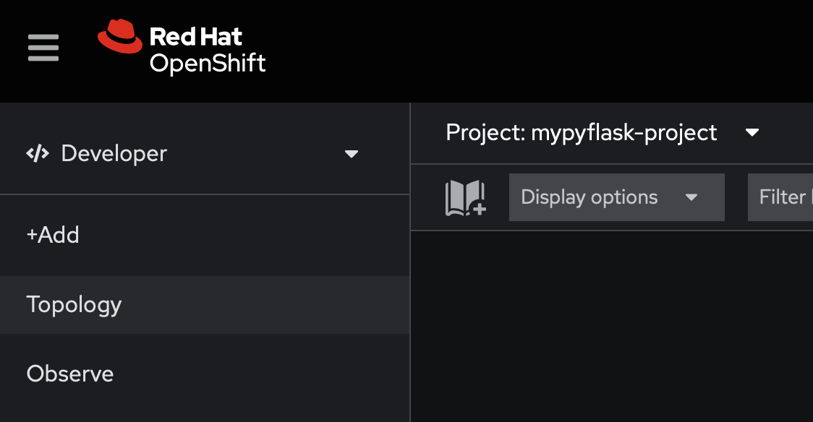{: loading=lazy width="600"}

---

8. Verify that the *Project* is set to the same one you created as an administrator in Step 5 (`mypyflask-project`).

---

9. Deploy your first application to the OCP cluster. From the left navigation bar, click **+Add**.

---

10. From the list of available sources, use the **Container Images** category.

    </br>
    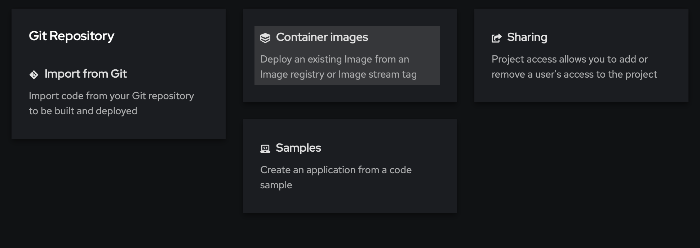{: loading=lazy width="600"}

---

11. To pull code from an image hosted within a Red Hat Quay.io repository, first navigate to the **Deploy Image** page and supply the following address under the *Image name from external registry* field:

    ```
    quay.io/dpkshetty/pyflask:v1
    ```

---

12. Scroll down until you reach the **General** section. Here you can provide an *Application Name* (`mypyflask-app`) and a unique *Name* (`mypyflask-app`) that will be associated with the resource. Note that if an image already exists in OCP with the same name you will receive an error message — be sure to use a unique name.

    </br>
    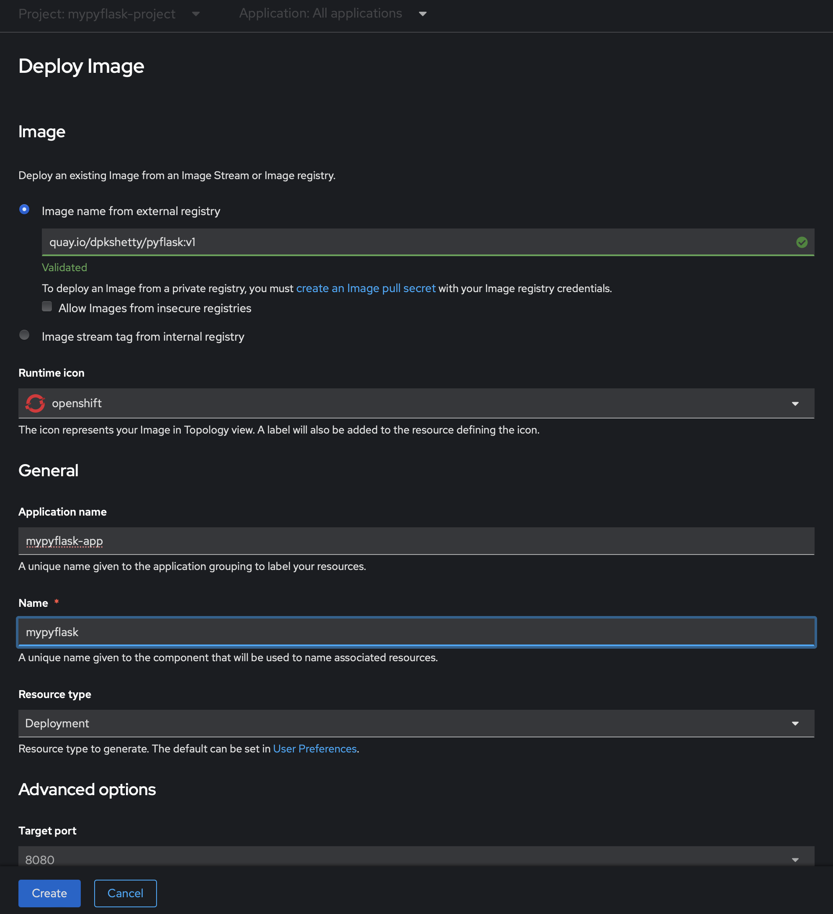

---

13. Further down you will reach the **Resources** section. Here, there are two options for the type of resource OCP will generate. Select the `Deployment` option.

---

14. Make sure that the **Create a route** to the application box is *enabled* before continuing.

---

15. Click the **Show advanced Routing options** button to expose additional settings.

---

16. Ensure that the **Target Port** field is set to `8080`.

---

17. *Enable* the **Secure Route** option.

---

18. Set the **TLS Termination** field to `Edge`.

---

19. Set the **Insecure Traffic** field to `None`.

---

20. When satisfied, click the **Create** button to continue.

    </br>
    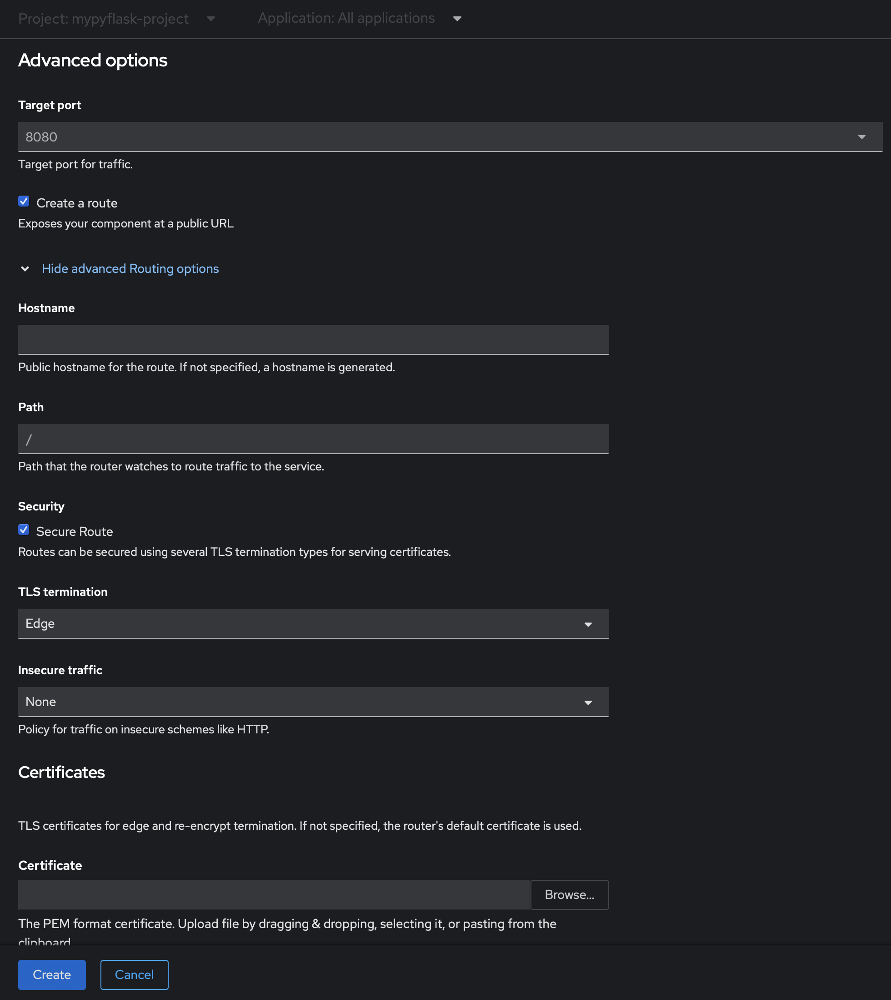

    </br>
    You can inspect the OpenShift cluster using the Web graphical user interface to verify that the application deployment is underway. From the **Topology** page, you can view the pod deployment which is underway. It will take several moments for the pod to be initialized and brought to a *Running* state.

---

21. From the **Topology** page, click on the **rectangular icon** containing text similar to `(DC) mypyflask` (your exact naming may differ), located just below the OpenShift logo at the center of the tile. Doing so will pull open an overview panel along the right side.

    </br>
    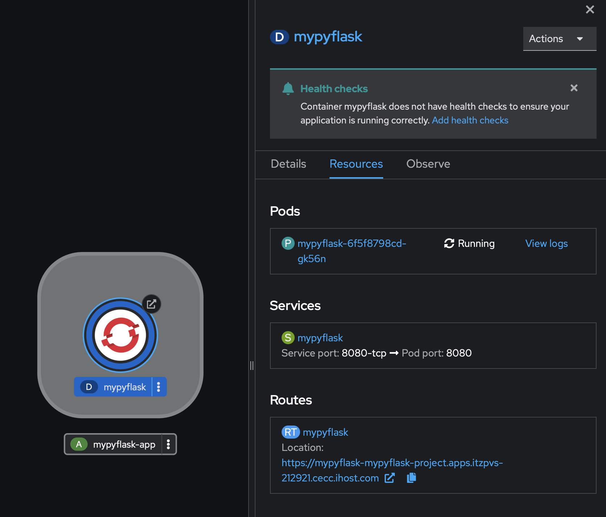{: loading=lazy width="600"}

---

22. Click on the **Location:** URL located at the bottom of the panel, under the *Routes* section, to launch a new web browser tab where the live application is running.

    </br>
    {: loading=lazy width="600"}

---

Now that you have successfully deployed the application using the existing *Quay.io* image, you are ready to demonstrate how to scale and rollback the application.

Your next step will be to scale the application using replicas of the pod deployed in the previous section. The creation of multiple replicas of a pod will help Amy and her team to ensure that their application’s deployment always has the available capacity (and resources) to meet the need of any increased demand for the application within the company.

---

23. Return to the **Topology** page from Step 21, select the application's name as before, and then drill down into the **Details** tab along the right-hand side of the interface.

---

24. Take note of the blue circular ring, which describes the number of replica pods currently supporting the live application.

    - Click the *up arrow* (right of the circle) **4 times** to scale the app to a total of 5 replicas
    - Scaling will begin immediately, but will need a few moments to complete
    - Wait until the count inside the blue circles reads `5 Pods` before continuing

    </br>
    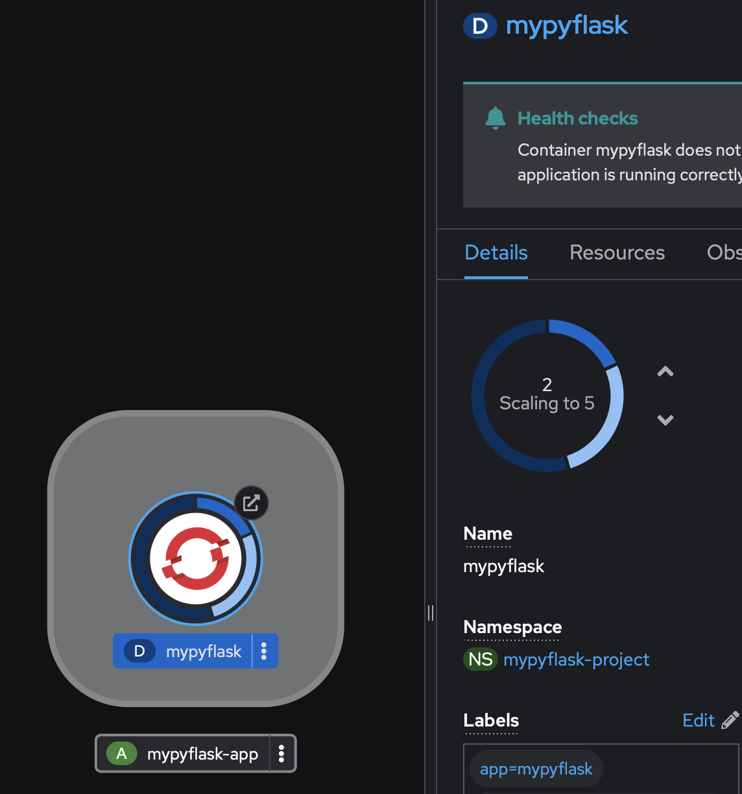{: loading=lazy width="600"}

---

25. Once you have verified that 5 replica pods are running, click the **Resources** tab. Just to the right of the *Pods* category is the **View All 5** button — click this.

    Your browser will be directed to the *Deployment* page, with the *Pods* tab pre-selected. From this screen you can inspect at-a-glance details on all (5) pod replicas running within the OpenShift cluster.

    </br>
    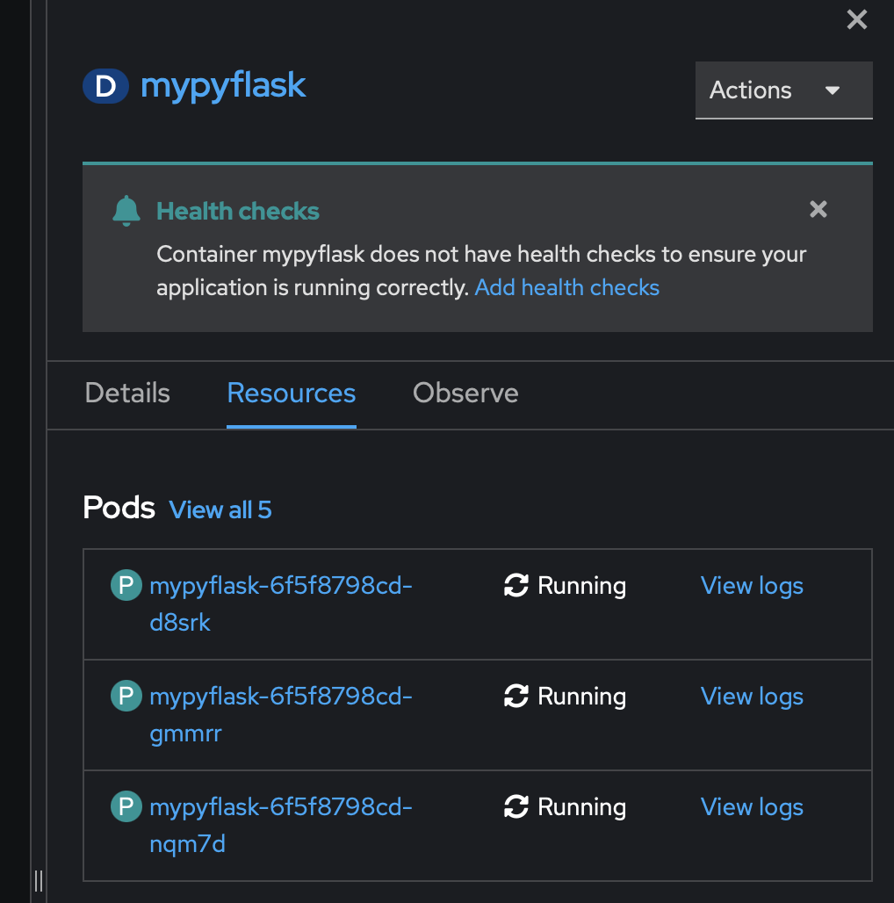{: loading=lazy width="600"}

---

26. Click on the **Deployments** link. Your browser will be redirected to a *Deployment* overview showing the `mypyflask-app` and `pod` status.

    </br>
    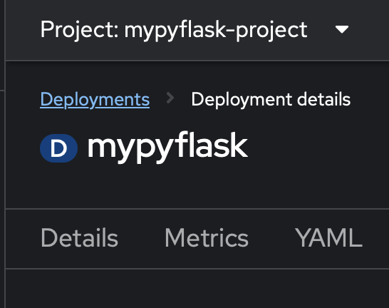{: loading=lazy width="600"}


---

27. At the far right of the table, locate the *three stacked dots* and **click** it to pull down a menu of options.

    Select the **Edit mypyflask-app** option.

    </br>
    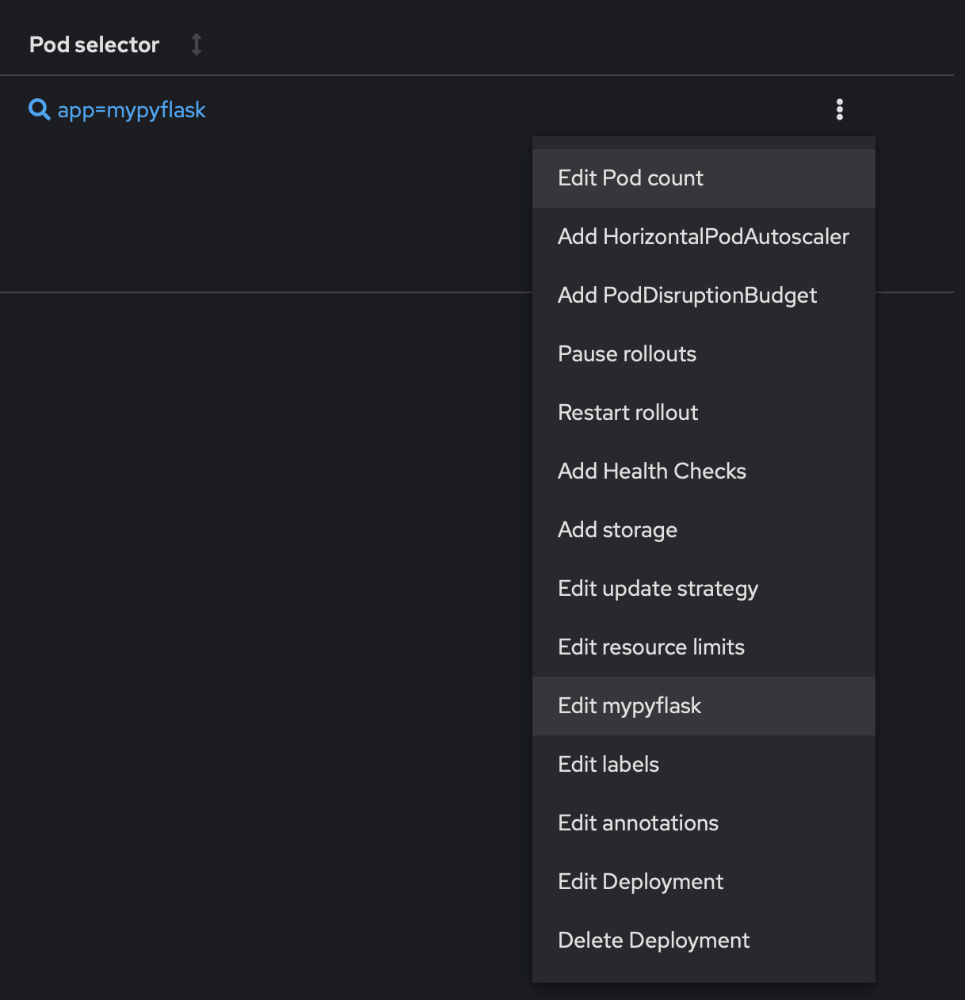{: loading=lazy width="600"}

---

28. From the *Deploy Image* page, scroll down and locate the *Image* section.

    - Within the **Image name from external registry** field, change the address from `v1` to `v2`.
    - **Save** your changes at the bottom of the page.

    </br>
    Your browser will then be taken back to the *Resources* view.
    
    !!! warning "FAILS TO SAVE"
        If the configuration change (after adjusting `v1` to `v2`) fails to **Save** on the first attempt, try hitting the **Save** button a second time.

    Some patience is required as you see the page gradually update and the changes roll across the various replica pods. Over time you will see “View all 8” or “View all 10” pods, and so on.

    - Clicking on **View All** as done previously (Step 25), you'll see the old pods (representing the `v1` deployment) being terminated and new pods (representing `v2`) being created.
    - **Wait** for all old pods to *terminate* and new pods to be in a *Running* state before continuing (a total of 5 pods will remain by the time this process concludes).

    </br>
    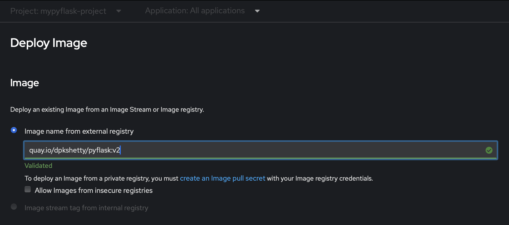{: loading=lazy width="600"}

---

29. One way to verify that the new pods are in fact running the updated application is to inspect the pods themselves.

    - Click the application tile on the **Topology** screen to expose the *Details* panel.
    - Drill down into the **Resources** tab.
    - Click any of the five pod *names* from the list.

    </br>
    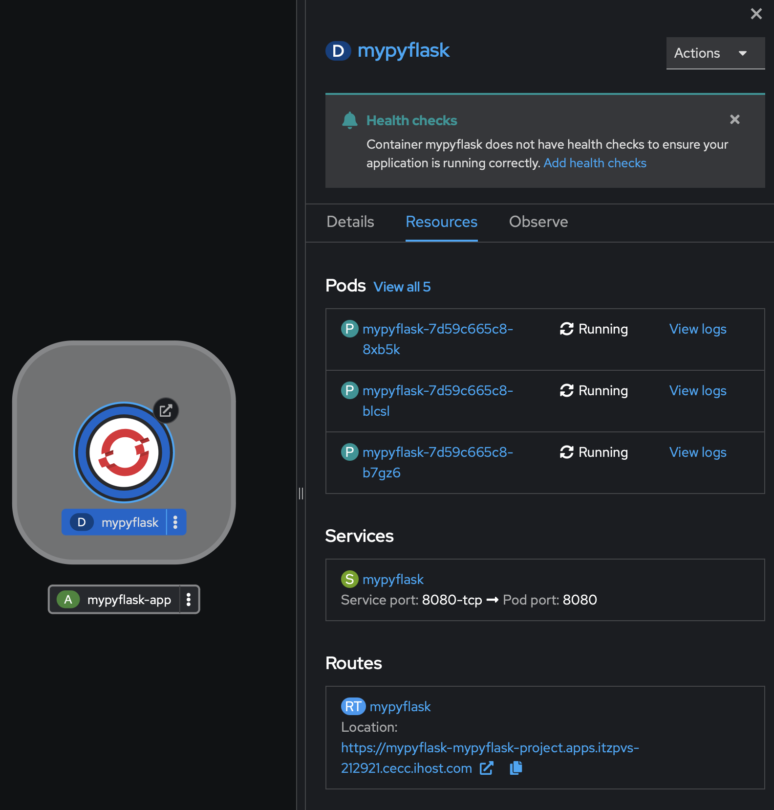{: loading=lazy width="600"}

---

30. Drill down into the **YAML** (Yet Another Markup Language) tab.

    </br>
    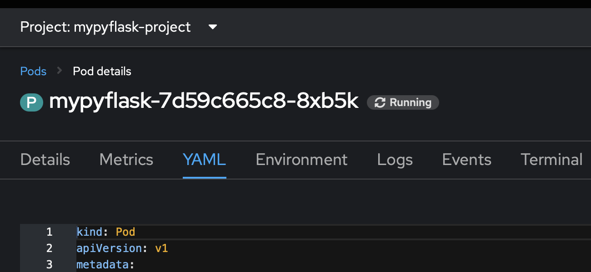{: loading=lazy width="600"}

---

31. Scroll down to the end of the YAML file for additional details on the status and parameters of the modified app.

---

32. Another (faster) way to verify the update occurred is to go back to the **Topology** page and click on the application’s tile icon to pull open the *Details* panel.

    Drill down into the **Resources** tab.

---

33. Scroll down to find the *Routes* section. Click the **Location:** URL to open a new browser tab running the latest live version of `mypyflask-app`.

    </br>
    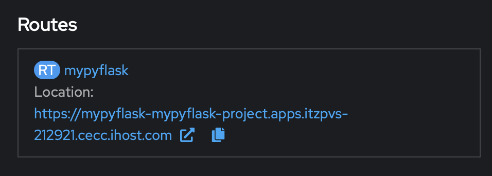{: loading=lazy width="600"}
    
    </br>
    {: loading=lazy width="600"}

---

34. The text rendered on-screen should display `VERSION 2.0`, which confirms for Amy and the team (and yourself) that the update was successfully pushed to the live deployment.

    When performing a rollback, you can see references to old replicas and new replicas. In this project, the old replicas are the original 5 pods you deployed in the previous steps when you scaled the application. The new replicas come from newly created pods with the fresh image. All pods are owned by their respective deployment. The deployment manages these two sets of pods with a resource called a *ReplicaSet*.

---

35. To view the *ReplicaSet* for `mypyflask-app`, return to the **Topology** page and click on application tile to application's *Details* panel.

    - Click the application's name `(D) mypyflask` that is located at the top of the panel. There is usually a *Health Checks* notification located just below this name.
    - Wait for the the *Deployment Details* page to load.

    </br>
    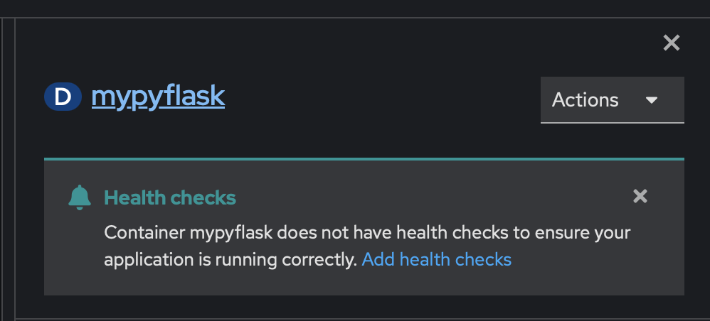{: loading=lazy width="600"}

---

36. From the list of tabs, drill down into **ReplicaSets**.

    </br>
    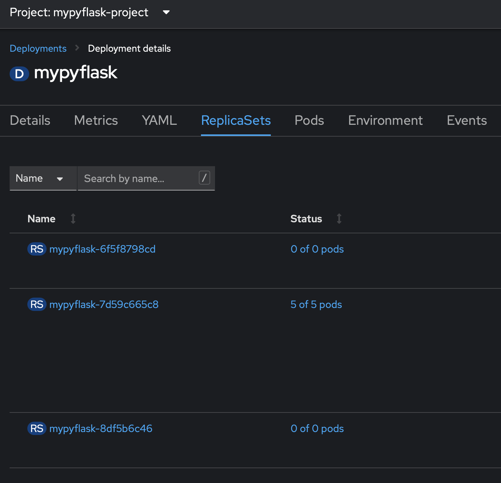{: loading=lazy width="600"}

    On the *ReplicaSets* page you will see both old (potentially 2 old) and (one) new *ReplicaSets*, mapping to `v1` and `v2` of `mypyflask-app`, respectively.

---

37. To undo (rollback) a deployment from `v2` back to `v1`, click the **three stacked dots** icon (at the far right of `0 of 0 pods`) to expose a drop-down menu of additional options.

    Select the **Rollback** option to execute a version change back to `v1`.

    </br>
    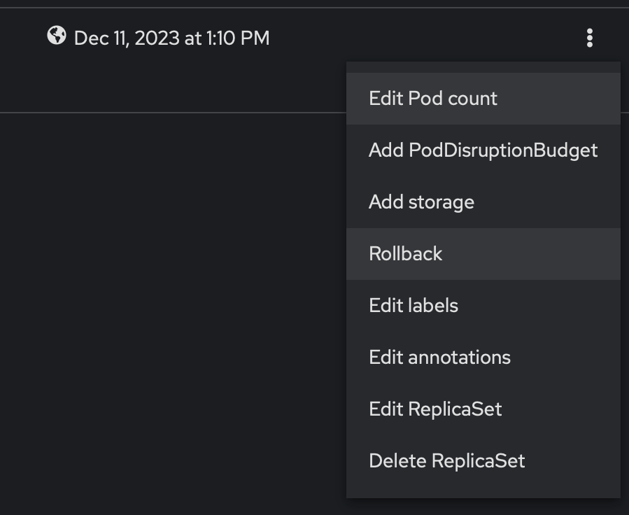{: loading=lazy width="600"}

---

38. You will see a new *ReplicaSet* created and pods will soon be added to that grouping. Wait for the `v2` *ReplicaSet* to display `0 of 0 pods` and for the rolled-back (`v1`) *ReplicaSet* to display `5 of 5 pods`.

---

39. **Verify** that the *ReplicaSet* of 5 pods are running `v1` of the application, using the same steps as before: either by checking the *YAML* tab  (Steps 29–31) or *Topology < Location URL* live application view (Steps 32–34).

---

#
# Next Steps

In the following module, you will learn how to perform these steps programmatically using Red Hat OpenShift's command line interface (CLI).