# **Module C**: Programmatically create, scale, upgrade, and rollback an OpenShift application

---


!!! tip "WATCH THIS DEMONSTRATION"
    **Christopher Bienko** (Principal, Learning Content Development, Hybrid Cloud) performs a hands-on demonstration of *Module C* using a live Red Hat OpenShift environment.

    Additional ways to watch: <a href="https://ibm.seismic.com/Link/Content/DCJQbXPbG4qcc8HQ6fgjHdHhd4dB" target="_blank">direct download available from Seismic</a> (*12 minute runtime*).

---

The following steps will replicate the work done previously in *Module B*, but this time using a programmatic (command-line) driven approach, rather than Openshift's web-based graphical user interface.

The first step will be the creation of an application within OpenShift Container Platform (OCP) from an existing image hosted on the **Red Hat Quay.io** repository. In this module, you will be performing these operations programmatically using remote connections over SSH (via Terminal or Putty). The numbering of these instructions continues from *Module B*.

!!! note "COMMAND LINE ACCESS"
    In the module ahead, you will be required to establish connections over SSH to remote infrastructure endpoints. It is recommended that users do so via **Terminal** (Mac) or **PuTTY** (Windows). For detailed instructions on how to connect with PuTTY, or if you are using a Windows machine, <a href="https://ibm.box.com/s/d71tn63hutdxrjwh21qdzralrsxlcspe" target="_blank">reference the linked material</a>.

---

40. If you are not logged into the Red Hat OpenShift cluster already, do so now. You will need to access parts of the OpenShift dashboard briefly before you can get to work over an SSH connection.

---

41. Set the perspective viewer to **Administrator** from the drop-down in the top-left corner.

---

42. In the top-right corner of the dashboard, click the **cecuser** button (the account name you are currently logged in under) to open a drop-down menu.

    - Click the **Copy login command** option from the menu. You will be asked to login using `htpasswd` a second time.
    - Your browser will open a new window which is mostly white, except for a **Display Token** link in the top-left — **click** this link to generate a login string.

    </br>
    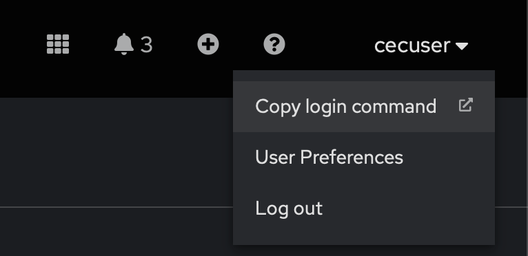{: loading=lazy width="600"}

---

43. OpenShift will generate a *limited-time API token* for logging in to the OCP cluster remotely.

    **Copy** the complete value under the *Log in with this token* string (`oc login ==token...`) and save it to a notepad, as you will be making use of this API token shortly.

    </br>
    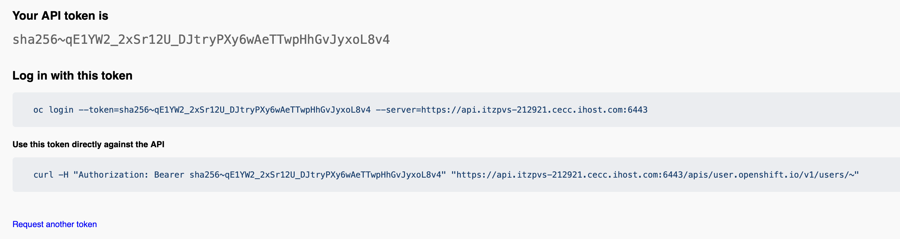{: loading=lazy width="600"}

---

44. Return to the **My Reservations** tab of IBM Technology Zone and drill down into your OpenShift reservation for additional **Environment** details.

    - Locate the **User Private SSH Key** variable and copy it to clipboard using the shortcut.
    - **Save** the complete key value (including the `BEGIN` and `END` lines) to a new notepad file named `privatekey.pem` on local Desktop so that it can be quickly referenced later.

    </br>
    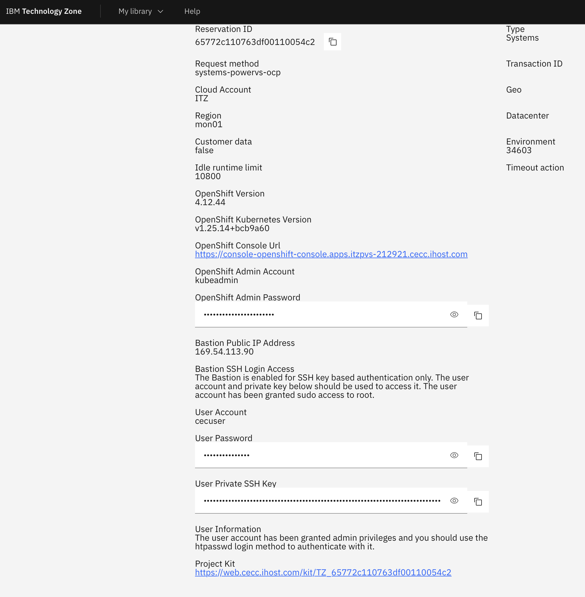{: loading=lazy width="600"}

---

45. Open a **Terminal** console (or PuTTY) on your local machine and navigate to Desktop (or the directory you saved the `.pem` file to) with the following command:

``` bash
cd Desktop
```

---

46. Execute the following instruction to set the appropriate access privileges on the `.pem` file:

``` bash
chmod 600 privatekey.pem
```

---

47. Now add the private key to the keychain of your local machine. If you are running on a Mac, this instruction can be invoked using the following:

``` bash
ssh-add --apple-use-keychain privatekey.pem
```

---

48. Return to the ITZ **My Reservations** summary for the OCP environment once again for **Environment** details. Locate ahd copy the value of the **Bastion Public IP Address** to your clipboard. It should be something similar to:

```
169.54.113.90
```

Retain this value for your records as you will need it again later.

---

49. With your Terminal window still open and in the same directory as your private key file (`~/Desktop`), execute the following after substituting in the address from Step 48:

``` bash
ssh cecuser@address-from-step-48
```

When logging in, you may receive a prompt asking whether to *“Use insecure connections?”* — respond with `y` and hit the `Return` key to continue.

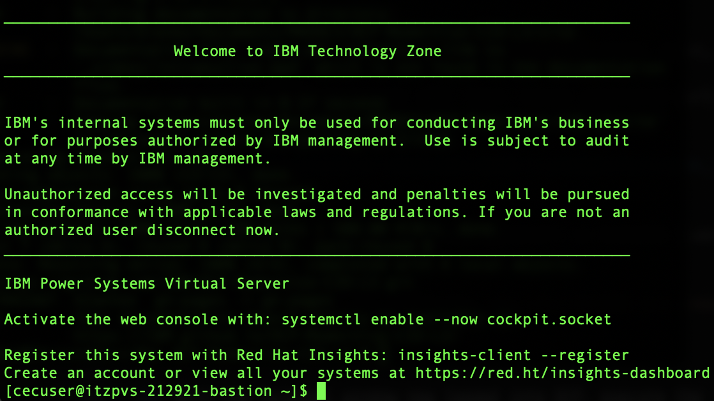{: loading=lazy width="600"}

---

50. You are now connected to the *PowerVS bastion host*. Next, you need to login to the OCP cluster running on this infrastructure.

    To do so, make use of the *API login token* generated earlier in Step 43. **Paste** that string into the Terminal window and execute.

??? warning "LOGIN FAILED"
    
    Remember to use your **own** unique API login token. It should look similar to `oc login --token=sha256~qE1YW2_2xSr12U_DJtryPXy6wAeTTwpHhGvJyxoL8v4 --server=https://api.itzpvs-212921.cecc.ihost.com:6443`.
    
    If the login fails, try replacing `api.cecc-251990.cecc.ihost.com` with `localhost` instead, and try again.
    
    You might be prompted once again to *"Use insecure connection (y/n)?"* — respond with `y`. After authenticating, the Terminal will now be remotely logged into the OpenShift on PowerVS cluster and ready for deploying applications into containers.

    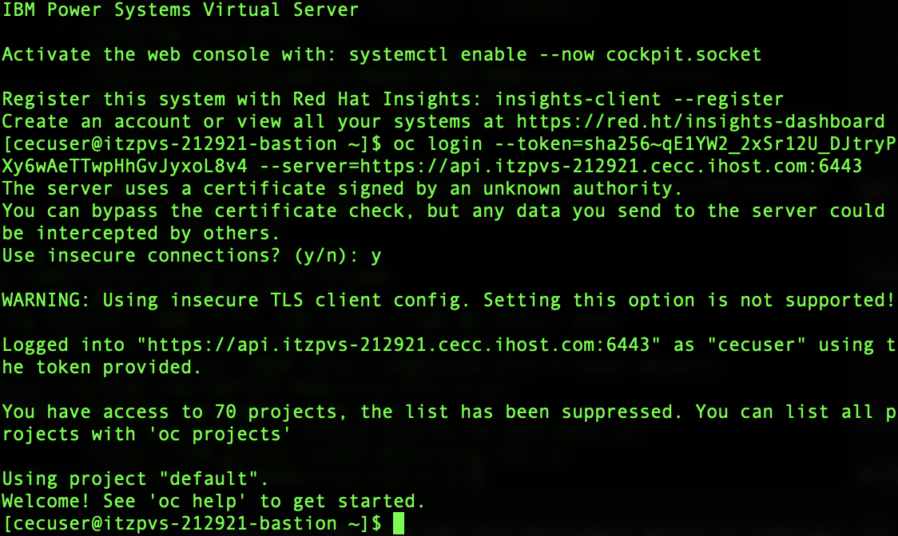{: loading=lazy width="600"}

---

51. With the Terminal window now logged into OCP, execute the following to create a new *Project* (in effect the same thing you did in Module B through the web graphical interface):

``` bash
oc new-project pyflask-project
```

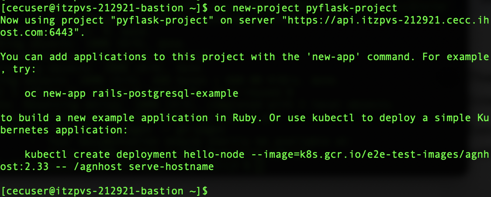{: loading=lazy width="600"}

---

52. Create a new deployment resource using the *Quay.io* image in the `pyFlask` project defined just a moment ago:

``` bash
oc create deployment mypyflask --image=quay.io/dpkshetty/pyflask:v1
```

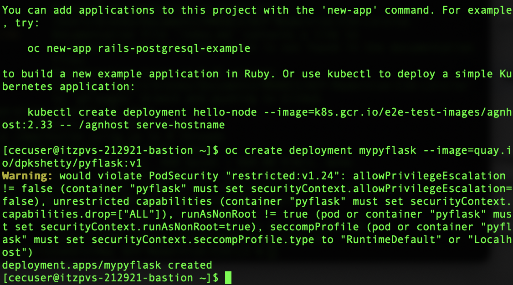{: loading=lazy width="600"}

??? note "CHECK DEPLOYMENT PROGRESS GRAPHICALLY"

    You can inspect the OpenShift cluster using the Web graphical user interface to verify that the application deployment is underway.

    Return to the OpenShift dashboard and switch to the **Administrator** perspective. Then click **Topology**.

    Here you can view the pod deployment which is underway. It will take several moments for the pod to be initialized and brought to a *Running* state.

    Click the center of the deployment (the round icon on the *Topology* page) to check the changing status of the pod. Make sure that your `pyflask-project` is selected under *Project* (top-left corner), otherwise the Topology space may appear as empty.

---

53. The deployment instruction you just issued to the cluster will generate a corresponding *pod* (containerized application) that will be deployed to into a *Running* (live) state.

    Execute the following instruction within Terminal to list all of the running pods available within your *namespace*:

``` bash
oc get pods
```

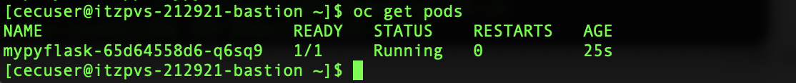{: loading=lazy width="600"}

---

54. Next, you need to expose the deployment’s `8080` port so that a route to the application can be created:

``` bash
oc expose deployment mypyflask --port=8080 --type=NodePort
```

---

55. Execute the following command to view the service:

``` bash
oc get service
```

!!! warning "RECORD THIS VALUE"

    Record the value under the `EXTERNAL-IP` field for your records.

---

56. In order to make the exposed service accessible externally (to the public), you must define a *public router*. To do so, return to the OpenShift cluster web dashboard and switch to the **Administrator** perspective.

    - From the menus on the left side, drill down into **Networking** > **Routes** and then **Create Route** (blue icon in the top-right corner).
    - Click the **Project:** drop-down menu at the top of the page and ensure that the value is set to `pyflask-project` before continuing with defining the new *Route*; otherwise, the *Service* created in Step 52 will not display in the configuration tool on Step 57.

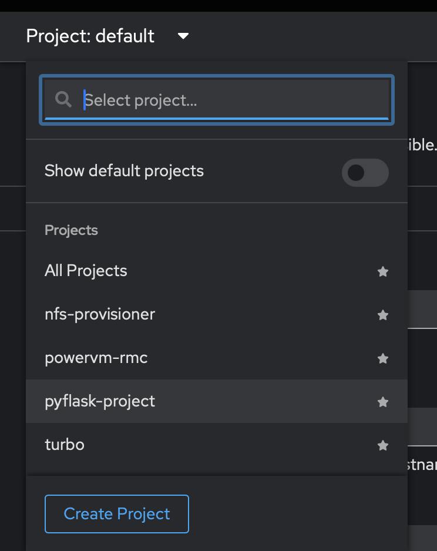{: loading=lazy width="600"}

---

57. Define a new **Route** with the following parameters:

    - *Name*: `mypyflask`
    - *Service*: select the `mypyflask` service from Step 52
    - *Target Port*: `8080->8080 (TCP)`
    - *Secure Route*: `enabled`
    - *TLS Termination*: `Edge`
    - *Insecure Traffic*: `None`

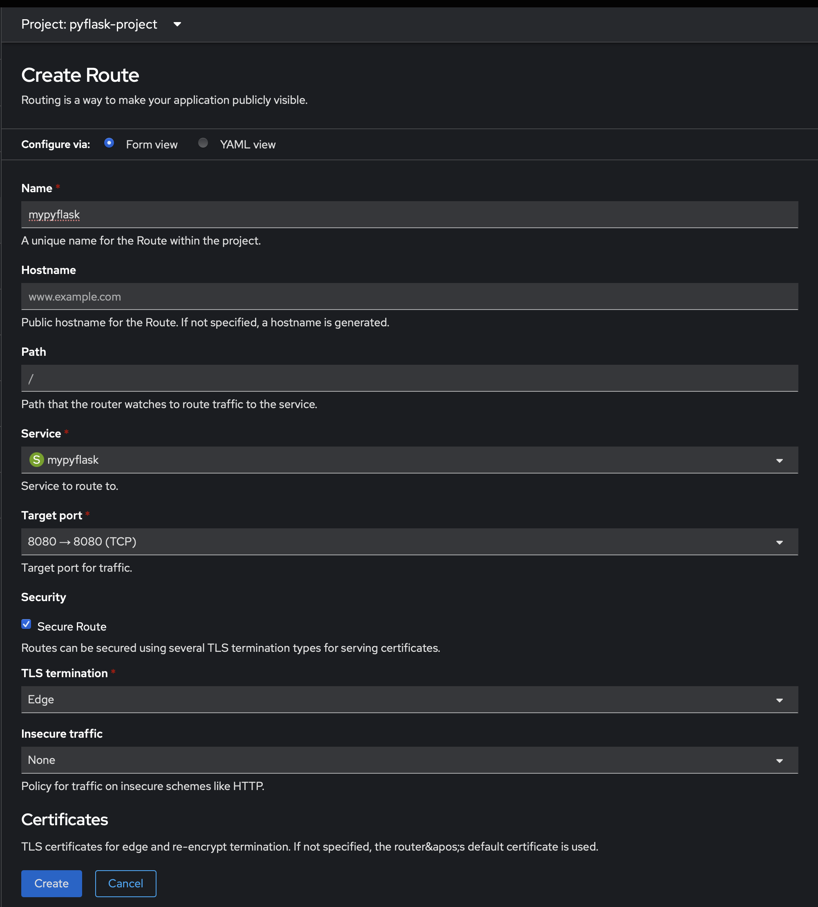{: loading=lazy width="600"}

---

58. When satisfied, click **Create**.

---

59. Once the route has been defined and created, your browser will redirect to the Route Details panel. Here you will find additional configuration and health check details about the status of your route.

    Click the *URL* below the *Location* section to view a live deployment of the `mypyflask` app.

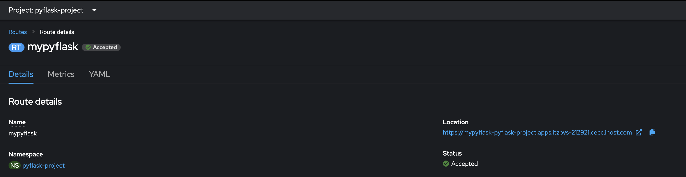{: loading=lazy width="600"}

!!! warning "RECORD THIS VALUE"

    Record the output rendered in the web browser when viewing the live `mypyflask` application in a new tab.

---

Now that you have successfully deployed the application using an existing *Quay.io* image, try scaling and rolling back the application. The creation of multiple replicas of a pod will help Amy and her team to ensure that their application’s deployment always has the available capacity (and resources) to meet the need of any increased demand for the application within the company. 

60. Returning to the Terminal console, execute the following command to increase the capacity of the pod from a single (`1`) instance up to `5` instances:

``` bash
oc scale --replicas=5 deployment/mypyflask
```

---

61. Check the status of the deployment:

``` bash
oc rollout status deployment mypyflask
```

---

62. Verify that there are now `5` pod instances running:

``` bash
oc get pods -n pyflask-project
```

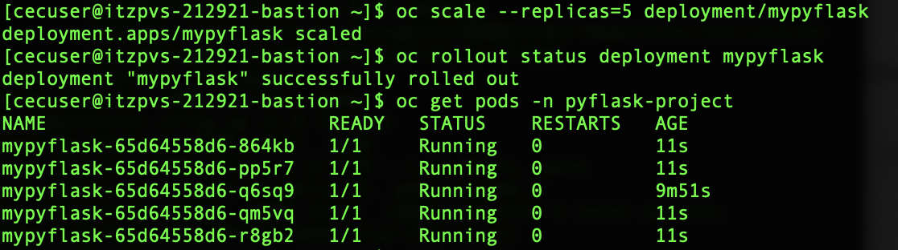{: loading=lazy width="600"}

---

Amy’s team will next want to perform a **rolling update** to the application, thereby deploying it to a new container image. The *“rolling” update* capabilities of OpenShift make it possible for her team to **update** the running image — as well as perform an *“undo” (rollback) operation* to the same imge, if a problem is later discovered.

You will shhowcase these *"rolling" update* capabilities in two ways:
- First, by updating the application from `v1` to `v2`
- Second, by rolling back the update to revert the application back to `v1`

---

63. Update the application from `v1` to `v2` by executing the following:

``` bash
oc set image deployment/mypyflask pyflask=quay.io/dpkshetty/pyflask:v2
```

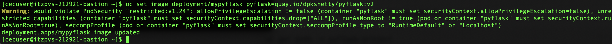

---

64. Check the status of the rollout:

``` bash
oc rollout status deployment/mypyflask
```

---

65. Retrieve a list of newly-launched pods with the `v2` image:

``` bash
oc get pods -n pyflask-project
```

---

66. Further inspect the details of any of the five pods retrieved in Step 65 and use the following command to confirm that the pod is using the `v2` application image:

``` bash
oc describe pod <pod-name>
```

Replace `<pod-name>` with the value in Step 65. Do not include the `< >` braces when executing the modified instruction.

!!! warning "RECORD THIS VALUE"

    Record the value to the right of *Image* under the *Containers* section.

Notice that the service and router objects remain unchanged, despite having updated the underlying *Quay.io* image version of the running pod.

---

67. Return to the **Route Details** panel (Step 59) and once again click the *URL* under the *Location* category. This will launch a new browser window where the `v2` update of `mypyflask` will be live and accessible.

    Take note of the updated message printed to screen.

---

When performing an application rollback, Amy’s team is able to inspect references to both old replicas and new ones. In the case of the `mypyflask` application, you should expect to see old replicas of the original 5 pods deployed earlier when you scaled the application.

The new replicas will be generated as a result of deploying 5 newly-created pods with the new application (`v2`) image. OpenShift uses a resource called a *ReplicaSet* to manage these two sets (old replicas and new replicas).

---

68. To see the `mypyflask` application *ReplicaSets*, execute the following instruction within the Terminal console:

``` bash
oc get replicasets -l app=mypyflask
```

The number of `DESIRED`, `CURRENT`, and `READY` *ReplicaSets* for the application should each display `5`.

---

69. Undo the results of the previous (`v2`) update by using a *rollout* instruction set:

``` bash
oc rollout undo deployment/mypyflask
```

---

70. Use the `status` command to check the details of the deployment now that the earlier changes have rolled back:

``` bash
oc rollout status deployment/mypyflask
```

---

71. Get a list of the newly-created pods:

``` bash
oc get pods
```

If you perform this step quickly after executing the instruction on Step 69, you'll likely see a mixture of *Running* and *Terminating* pods. After a few moments, the *Terminating* pods will be destroyed and only the *Running* (rolled back) pods will remain.

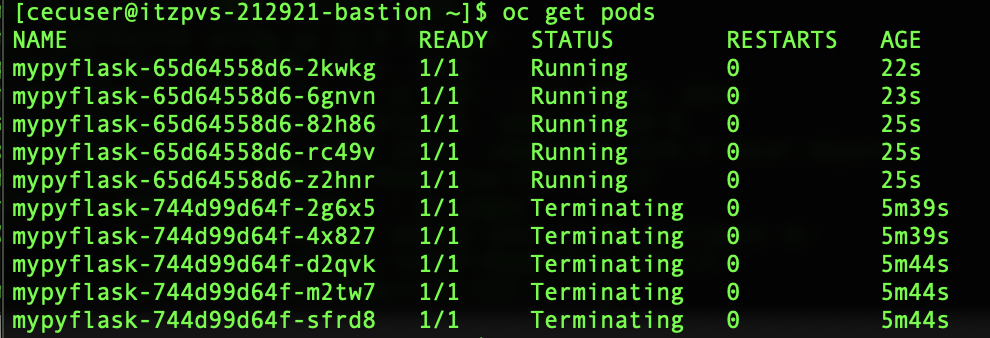{: loading=lazy width="600"}

---

72. As you did previously in Step 66, use the `describe` command (and the name of one of the pods from Step 71) to verify that the `version` of the application has rolled back to `v1`:

``` bash
oc describe pod <pod-name>
```

Replace `<pod-name>` with the name of the pod recorded in Step 71. Do not include the `< >` braces when executing the modified instruction.

---

73. Repeat your inspection of the *ReplicaSets* that was first performed in Step 68:

``` bash
oc get replicasets -l app=mypyflask
```

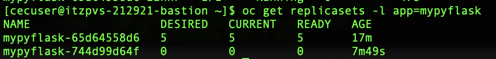{: loading=lazy width="600"}

Notice that there’s still two sets of *ReplicaSets*: the *old* replicas and the *new* replicas. And as before, the number of `DESIRED`, `CURRENT`, and `READY` sets are equal to `5`.

However, the `ACTIVE` sets (where the value is `5`) have now been assigned to the list *old* replica sets — as opposed to previously in Step 68, where they belonged to the *new* replica sets. This confirms that the old *ReplicaSet* list is now active and managing 5 different pod replicas.

---

74. Return to the **Route Details** panel on the OpenShift web dashboard (Step 59) and click the *URL* under the *Location* category. This will launch a new browser window, which should display the `v1` version of `mypyflask` once again. This confirms that the rollback operation was a success.

---

Well done! You’ve succeeded in managing Amy's app programmatically via Red Hat OpenShift on Power. That concludes the hands-on components to this Level 3 course.

You are encouraged at this stage to complete your <a href="https://ibm.github.io/OCP-Modernize-CIO-L3/evaluation/" target="_blank">Level 3 accreditation</a>. Requirements will vary depending on your job role.