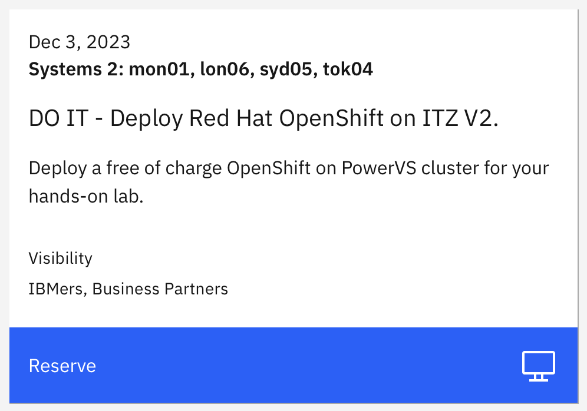
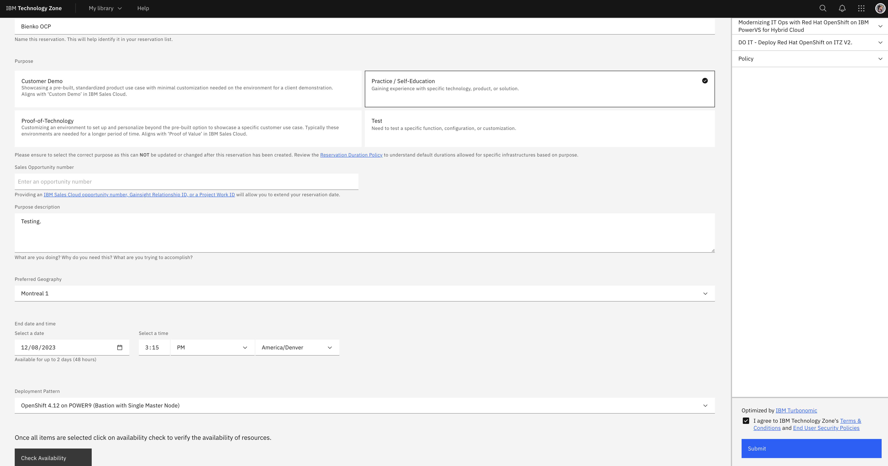
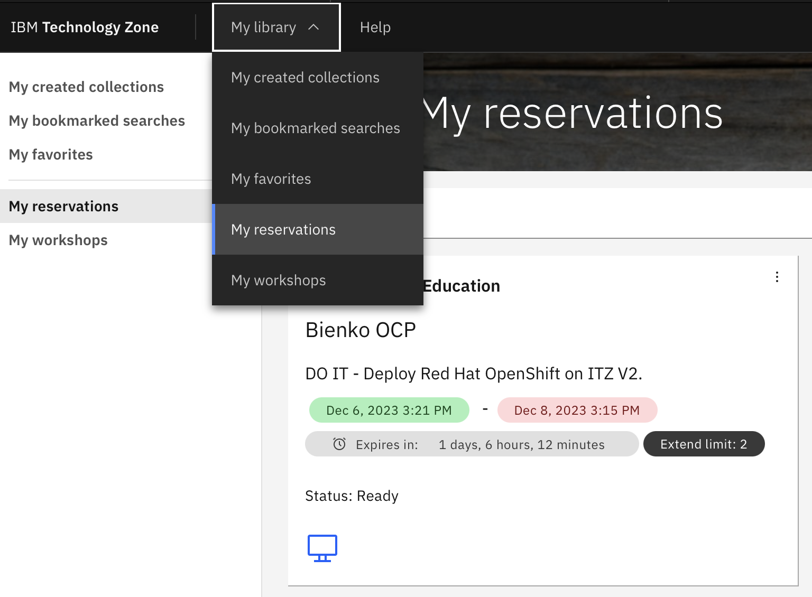
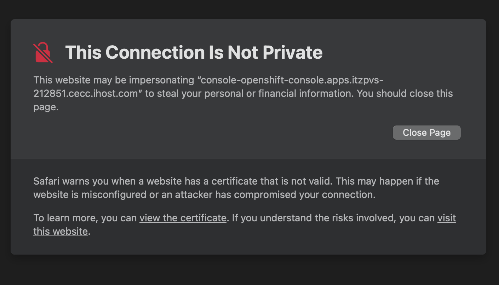
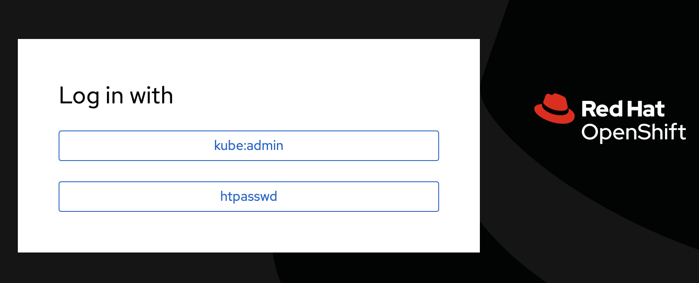
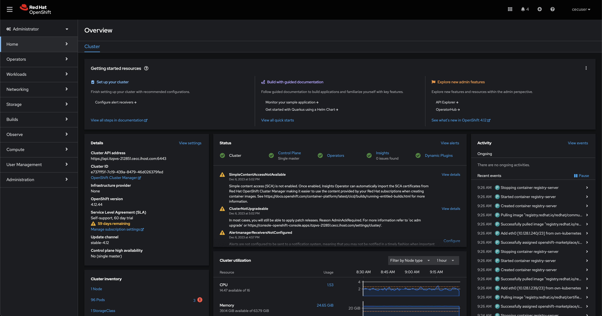

# Prerequisites and Setup

---

Hands-on demonstration environments will be provisioned free-of-charge from the IBM Technology Zone (ITZ). Reserve only for the time you need. These are finite resource and limiting your reservation time ensures that more IBMers and business partners can leverage the resources for client engagements.

---

**RESERVE AN ENVIRONMENT**

<a href="https://techzone.ibm.com/collection/modernizing-business-for-hybrid-cloud-with-ibm-power" target="_blank">https://techzone.ibm.com/collection/modernizing-business-for-hybrid-cloud-with-ibm-power</a>

---

1. Visit the <a href="https://techzone.ibm.com/collection/modernizing-business-for-hybrid-cloud-with-ibm-power" target="_blank">ITZ collection</a> with your web browser.

     
    {: loading=lazy width="600"}

---

2. From the interface along the left-hand side, click **Environments**. The page will refresh and present you with a `DO IT - Deploy Red Hat OpenShift on ITZ V2` tile.

    Click the blue **Reserve** button to navigate to the request form.

---

3. Select the option to **Reserve Now**.

---

4. Supply the following details into the request form:

    - *Name*: Set to a unique value of your choosing

    - *Purpose*: Set to `Practice / Self-Education`

    - *Sales Opportunity Number*: For the purposes of the hands-on Level 3, you can leave this blank. However, in accordance with the IBM Technology Zone terms of service, all client demonstrations that make use of ITZ resources *must* be accompanied by a genuine Sales Opportunity number.

    - *Purpose Description*: Please describe how the ITZ reservation will be used

    - *Preferred Geography*: Set to the data center located closest to you

    - *End Date and Time*: Automatically set 48 hours from the time the request is made

    - *Deployment Pattern*: Automatically set to `OpenShift 4.12 on POWER9 (Bastion with Single Master Node)`

---

5. Once satisfied, click the **Check Availability** button (a grey button in the bottom-left corner of the form). If the resources are available for that time slot, check the **Terms and Conditions** box in the bottom-right corner of the interface and then finalize the deployment by clicking **Submit**. 

    Deployments can sometimes take several (2-3) hours to complete from the time that the request has been made to the ITZ. Therefore, plan your deployment and lab time accordingly. You will likely need to wait a couple of hours before you can get to work on the hands-on components of this lab.

     
    {: loading=lazy width="600"}

---

6. When the environment is ready, you will receive a confirmation email from the ITZ and the status of the environment under the ITZ's **My Reservations** tab will be marked as `Status: Ready`.

    Follow the URL provided in the email or click the tile under the My Reservations tab to drill down into further details for accessing the environment.

---

7. Scroll down to the bottom of the page and take note of the following elements:

    - *OpenShift Console URL*: Use this address to access the OpenShift web interface

    - *User Account*: This will be set to `cecuser` for all environments

    - *User Password*: This value will be unique to *your* reservation

---

8. Access the **OpenShift Console URL** within your web browser.

??? warning "THIS CONNECTION IS NOT PRIVATE"

    Depending on your web browser, you may receive a warning about `This connection is not private` or a similarly phrased message. Disregard these warnings and continue to the intended destination by clicking *"visit this website."*

    {: loading=lazy width="600"}

---

9. Click the option to log in with **htpasswd**.

     
    {: loading=lazy width="600"}

---

10. For **Username**, supply `cecuser`. For **Password**, enter the `User Password` value you recorded in Step 7. Click the **Log In** button to proceed.

     
    {: loading=lazy width="600"}

    Once authenticated, the web browser will redirect to the main dashboard for the OpenShift Container Platform web interface. You are now ready to proceed with the hands-on lab modules.

---

#
# Next Steps

In the following section, you will explore two different ways to leverage OpenShift's S2I framework and "webhooks" for managing and deploying source code into live applications.

!!! note "COMMAND LINE ACCESS"

    For parts of the hands-on lab, you will be required to establish connections over SSH to remote infrastructure endpoints. It is recommended that users do so via **Terminal** (Mac) or **PuTTY** (Windows). For detailed instructions on how to connect with PuTTY, or if you are using a Windows machine, <a href="https://ibm.box.com/s/d71tn63hutdxrjwh21qdzralrsxlcspe" target="_blank">reference the linked material</a>.